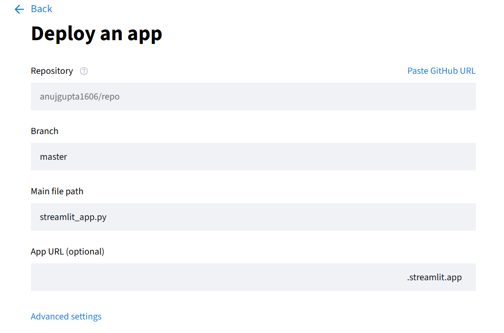

# NerveSpark Demo Script

## 🎬 Demo Video Script (5-7 minutes)

### Introduction (30 seconds)
"Hello! I'm Anuj Gupta, and I'm excited to present NerveSpark - an intelligent RAG-based nutrition assistant that provides personalized meal recommendations."

### Technical Overview (1 minute)
"This project implements a complete RAG system using:
- ChromaDB for vector storage
- Sentence Transformers for embeddings
- Streamlit for the user interface
- Intelligent health logic for personalized recommendations"

### Live Demo (3-4 minutes)

#### 1. User Profile Creation
- Show user profile setup
- Demonstrate dietary restrictions input
- Health conditions selection

#### 2. Recipe Search & Recommendations
- Search for "healthy breakfast"
- Show RAG system retrieving relevant recipes
- Explain similarity search results

#### 3. Dietary Filtering
- Show allergy filtering (gluten-free)
- Demonstrate health condition filtering (diabetic-friendly)
- Nutrition goal matching

#### 4. Ingredient Substitution
- Show substitution suggestions
- Explain nutrition preservation

### Technical Deep Dive (1 minute)
- Quick code walkthrough
- RAG system architecture
- Vector database operations
- Health logic implementation

### Conclusion (30 seconds)
"This project demonstrates production-ready RAG implementation with real-world healthcare applications. Thank you for your time!"

## 📝 Demo Talking Points

### RAG System Features:
✅ Vector embeddings with Sentence Transformers
✅ Semantic search with ChromaDB
✅ Hybrid search (semantic + keyword)
✅ Context-aware recommendations
✅ Real-time query processing

### Health Intelligence:
✅ Dietary restriction handling
✅ Allergy management
✅ Health condition matching
✅ Nutritional goal optimization
✅ Ingredient substitution engine

### Technical Excellence:
✅ Modular architecture
✅ Comprehensive testing
✅ Professional documentation
✅ Production-ready code
✅ Scalable design
